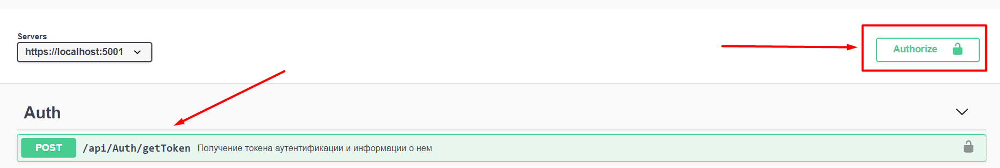
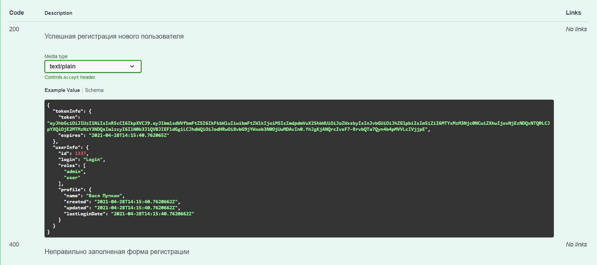

Этот проект - это REST API для моего дипломного проекта (интернет магазин). Работа над ним еще не закончена.

Для того чтобы залогиниться, нужно получить токен пользователя, нажать на кнопку "authorize" и ввести его 
(admin {login: "Admin", password: "1234"})

Для всех методов есть подробное описание, вот пример описание возвращаемого значения:

Вот как выглядит полное API на данный момоент:
![alt text](readMeAssets/full_api_view.png "Пример описания"